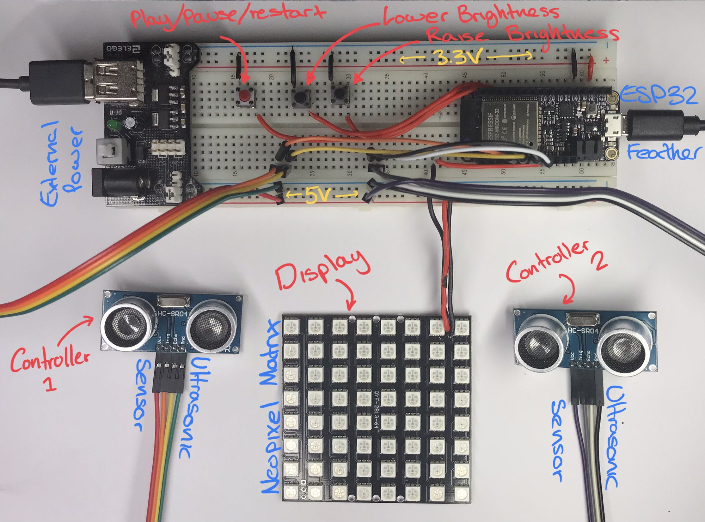

This repository contains the source code for **COM3505 Assignment 2**.

## Overview

*`Ultrasonic-Pixel-Pong`* (*`UPP`*) is a custom version of the classic game, *[Pong](https://en.wikipedia.org/wiki/Pong)*, implemented using *IoT* concepts of `sensing` and `actuation` as well as embedded systems practices of `task` and `interrupts` to add a new spin on the game.

*`UPP`* works much like regular  *[Pong](https://en.wikipedia.org/wiki/Pong)* with the exception of how it is `controlled` and `displayed`. 

**Display** occurs via a `neo-pixel LED matrix`, dictating aspects of the game such as the board size and resolution.

**Controlling** the game is done via two `ultrasonic sensors` (you can probably see where it gets its name now), one for each of the game `paddles`. The height that each of these `ultrasonic sensors` are raised to will control the height of the respective `paddle` - controlling the `paddles` through physical movements (and coordination).

A number of  `button` controls also exist for playing/pausing/restarting and LED brightness.

### Hardware

Below is a summary the hardware image for the set-up for the game (a full hardware list can be found further down).

*Hardware design*

### Features

#### - Decoupled Rendering, Player Control & Game State

Through the use of `tasks`, updates to rendering and game state updates have been decoupled to each use their own timer. This means that the underlying game logic (`ball` movement, collision detection etc) is capable of running at a different rate than updates to `paddles` controlled by the player and the rendering of the scene. This allows for variable game speed whilst maintaining responsive player constrols.

#### - Progressive Difficulty

As mentioned, the decoupled nature of the game systems means that player control and game state updates can run at different rates. This additionally allows for alterations of update rates whilst playing. This is used to increase the game speed with every collision of the `ball` with a `paddle` - it gets harder the longer the game goes on!

#### - Strategic Gameplay

`Paddles` have configurable `Hit Regions` : **TOP**, **MIDDLE**, **BOTTOM**. Depending on where the `ball` hits, its rebound behaviour will be altered.

- **MIDDLE** - collisions hitting the middle region of the paddle have deterministic behaviour - the X-direction component is inverted.
- **TOP/BOTTOM** - collisions hitting these regions have stochastic behaviour - the X-direction component is inverted and the Y-direction component is selected 'randomly' (as random as I could get it at least).

Position your `paddle` strategically to keep your opponent on guard.

#### - Customisation

Change:
- Size of `paddles`
- `Paddle` hit regions
- Colours

#### - Win Screen

Being a simple multiplayer game, a fully scoring system isn't implemented, instead a win screen will be displayed making it clear which side won (winning side will be green, losing side will be red) - no cheating allowed!

#### - Responsive Buttons

All `buttons` use `interrupts`, so they can be activated at any time. Pause the game any time, alter the brightness any time.

#### - Infinite Play

Once a game has ended, press the play/pause/restart button to reset the game to the starting state.
(Currently the ball will always go the same way at the start).

### Demo

You can watch a short demo of the features [here](https://drive.google.com/file/d/1fZmXSGXiZ2FCmuCpUtSnk7BZzE_qQBx2/view?usp=sharing).

## Structure

This project is structured in accordance with the `platformio` project structre:

```.
ProjectThing
├── README.md	
├── include
│   └── ProjectThing.h             Non-logic config (i.e. colours)
├── lib
│   └── PixelPong
│       └── src
│           ├── Ball.cpp           Ball entity
│           ├── Ball.h
│           ├── Board.cpp          Board entity
│           ├── Board.h
│           ├── Helpers.cpp        Helper functions
│           ├── Helpers.h
│           ├── Paddle.cpp         Paddle entity
│           ├── Paddle.h
│           ├── PixelPong.cpp      Main game manager, handles state updates, collisions etc.
│           └── PixelPong.h
├── partitions.csv
├── platformio.ini
└── src
    └── main.cpp                   App entry point & Game Logic
```

### Key Elements

`[PixelPong/Ball]` 

- Represents the ball in the game of pong. Stores information such as ball position, velocity and has functionally for updating these aspects.

`[PixelPong/Board]` 

- Represents the game board in the game of pong. Contains functionality for win state and board boundary collision checking.

`[PixelPong/Helpers]` 

- Helpers for general functionality.

`[PixelPong/Paddle] `

- Represents a paddle in the game of pong. Handles paddle collision checking and determining which region of the paddle was hit. Stores information about the paddle such as size, position, anchor etc.

`[PixelPong/PixelPong] `

- Game manager. Handles updating the game state through coordination of the previously mentioned elements.

Game logic configuration options can be found in `[src/main.cpp]`.

## Testing

Given the visual nature of the project, most testing was done by playing the game and checking the mechanics manually in different states rather that using Serial debugging. However, in some aspects where things were hard to check visually (such as paddle collision regions), Serial debugging was used.

## Future Features

(i.e things I had planned but didn't get around to)

- **Full customisability** - A lot of the functionallity exists for fully custom board sizes and paddles. Paddle functionallity works, but the board size editing doesn't yet - likely an issue to do with how the neomatrix works.
- **Wireless controllers** - The cables are quite inconvenient for the paddle controllers. Would be good to use bluetooth or similar to get the ultrasonic sensor reading. Would need more research.
- **Web based customisation** - Using a web based interface to customise things like paddle colour.

## Shopping List

Below are the components used:

- ESP32 Feather
- 3 x Buttons
- 2 x HC-SR04 Ultrasonic Sensor
- 1 x NeoPixel Matrix with Adafruit_NeoMatrix compatible chipset
- 1 x 5V power source
- Many wires

## Design Notes

Notes made while designing this project can be found in `[assets/DesignNotes.pdf]`. These notes are not intended to improve understanding of the implemented system (as much of the notes are no longer representative or were found to be incorrect etc), but instead to serve as insight into the design and thought process as a point of interest. (formatting is a bit odd due to page splits)

